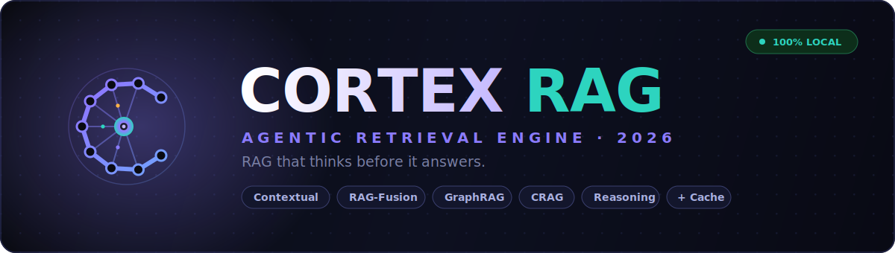

<p align="center">
  
</p>

<br/>

<h3 align="center">
  Agentic RAG System — Knowledge Base QA with LangGraph<br/>
  <sub>State-driven · Adaptive Retrieval · Fully Local · Zero API Keys</sub>
</h3>

<br/>

<p align="center">
  
  &nbsp;
  
  &nbsp;
  
  &nbsp;
  
  &nbsp;
  
</p>

---

## Overview

Agentic RAG System is a **production-ready personal knowledge base question-answering system** built with LangGraph's stateful workflow orchestration. Unlike naive RAG pipelines that chain functions linearly, this system models the entire retrieval-augmented generation process as a **directed state graph**, enabling adaptive behaviors such as query routing, semantic cache short-circuiting, automatic retry on low-confidence retrievals, and citation verification — all before the answer reaches the user.

**Key architectural decision:** The RAG pipeline is not a sequence of function calls — it is a **cyclic state machine**. When the Corrective RAG (CRAG) node determines that retrieved documents are not sufficiently relevant, the graph loops back to the query transformation node to broaden the search, rather than hallucinating an answer from bad context.

---

## Workflow Architecture

The LangGraph state graph implements the following node topology:

```
                         ┌──────────────┐
                         │    START     │
                         └──────┬───────┘
                                ▼
                         ┌──────────────┐
                         │    route     │  Query Router (rag / chat / summary)
                         └──────┬───────┘
                                ▼
                         ┌──────────────┐
                    ┌───►│  check_cache │──┐
                    │    └──────────────┘  │
               HIT  │                      │ MISS (chat)
                    │                      ▼
                    │               ┌──────────────┐
                    │               │   generate   │  Direct chat (no retrieval)
                    │               └──────┬───────┘
                    │                      │
                    │               ┌──────┴───────┐
                    │               │    verify    │  Citation verification
                    │               └──────┬───────┘
                    │                      │
                    │    ┌─────────────────┘
                    │    │
                    │    ▼
                    │ ┌──────────────┐
                    │ │   finalize   │  Store in cache, emit result
                    │ └──────┬───────┘
                    │        │
                    │        ▼
                    │   ┌─────────┐
                    └──►│   END   │
                        └─────────┘

   MISS (rag/summary)
         │
         ▼
  ┌──────────────┐     ┌──────────────┐
  │  transform   │────►│   retrieve   │  Multi-query / HyDE / retry-expand
  └──────▲───────┘     └──────┬───────┘
         │  low confidence    │
         └────────────────────┘         CRAG loop: max 1 retry
```

### Node Descriptions

| Node | Responsibility | Key Technology |
|------|---------------|----------------|
| **route** | Classifies incoming query as `rag`, `chat`, or `summary` | LLM-based intent classification |
| **check_cache** | Checks tiered semantic cache (embeddings / retrieval results / final answers); short-circuits on hit | Cosine similarity @ 0.92 threshold |
| **transform** | Rewrites query — HyDE (hypothetical document embedding), RAG-Fusion multi-query generation, or broader expansion on retry | LLM query rewriting |
| **retrieve** | Multi-path retrieval: BM25 sparse + Chroma dense + GraphRAG entity graph → CrossEncoder rerank → CRAG relevance grading | EnsembleRetriever, NetworkX, CrossEncoder |
| **generate** | LLM answer generation with real-time `<think>` chain-of-thought parsing | Ollama streaming API |
| **verify** | Post-generation citation verification to ensure `[Source N]` references match actual context | LLM-as-judge |
| **finalize** | Persists result to cache, assembles final response | Tiered cache write-through |

---

## Features

### 🔀 Agentic Workflow (LangGraph)
- **Stateful graph orchestration** — every step receives and returns typed state, enabling cyclic control flow
- **Conditional edges** — cache hits skip directly to finalize; low-confidence retrievals trigger automatic retry with broader queries
- **Built-in memory checkpointer** — LangGraph `MemorySaver` for thread-safe conversation state
- **Workflow visualization** — UI displays execution timeline for each node

### 🔍 Advanced Retrieval Pipeline
- **Hybrid search**: BM25 sparse (lexical) + Chroma dense (semantic) via `EnsembleRetriever` (0.35 / 0.65 weights)
- **GraphRAG**: Entity co-occurrence knowledge graph built with NetworkX; retrieves relationally connected chunks missed by pure vector search
- **HyDE (Hypothetical Document Embeddings)**: Generates a hypothetical answer passage before retrieval to bridge the lexical gap
- **RAG-Fusion + RRF**: Generates N query variants, retrieves independently, fuses ranked lists via Reciprocal Rank Fusion (k=60)
- **Neural Reranking**: `cross-encoder/ms-marco-MiniLM-L-6-v2` CrossEncoder re-scores candidates by true query-passage relevance
- **Corrective RAG (CRAG)**: LLM grades each retrieved chunk for relevance; irrelevant chunks are dropped; if all are irrelevant, triggers automatic retry with expanded query
- **Contextual Retrieval** (optional): Prepends LLM-generated situating context to each chunk before indexing (Anthropic technique)

### 💾 Tiered Semantic Cache
Three-level cache architecture to minimize redundant LLM calls:
1. **Embedding cache** — memoized query vectors
2. **Retrieval result cache** — cached document sets for repeated queries
3. **Answer cache** — semantic similarity cache on final answers (cosine ≥ 0.92 threshold); persists across sessions as JSON

### 📄 Document Processing
- **Supported formats**: PDF, DOCX, TXT, Markdown (.md)
- **Smart chunking**: `RecursiveCharacterTextSplitter` with paragraph/sentence-aware separators
- **Chunk cleaning**: Whitespace normalization, control character removal, metadata binding
- **Incremental indexing**: SHA-256 file hash-based change detection; only new/modified files are reindexed; no full rebuild required
- **Metadata enrichment**: Character count, document type, chunk-level contextual prefix (when enabled)

### 🎯 Query Routing
Intelligent intent classification routes queries to the right path:
- **rag** — knowledge-intensive questions requiring document lookup
- **chat** — general conversation / greetings that don't need retrieval
- **summary** — requests for document overview or summarization

### 🧠 UI Features
- Live `<think>` chain-of-thought panel (collapsible, real-time parsing)
- LangGraph workflow execution timeline visualization
- Typewriter-effect answer streaming
- Source citation cards with content previews
- Cached answer indicator with similarity score
- Document management sidebar with file/chunk statistics
- Suggested questions auto-generated from indexed documents
- Fully local — runs on your machine via Ollama

---

## Tech Stack

| Layer | Technology |
|-------|-----------|
| **Workflow Orchestration** | LangGraph 1.2, langgraph-checkpoint |
| **LLM Framework** | LangChain 1.3 (langchain-core, langchain-community, langchain-ollama) |
| **Vector Database** | ChromaDB (persistent, on-disk) |
| **Sparse Retrieval** | rank-bm25 (BM25Okapi) |
| **Knowledge Graph** | NetworkX |
| **Neural Reranker** | sentence-transformers CrossEncoder (ms-marco-MiniLM-L-6-v2) |
| **Embeddings** | nomic-embed-text via Ollama |
| **LLM Inference** | Ollama (local — llama3.1, qwen2.5, mistral, etc.) |
| **Document Parsing** | PyMuPDF (PDF), docx2txt (DOCX), MarkdownLoader |
| **UI** | Streamlit |
| **Dependency Management** | uv |
| **Language** | Python 3.11+ |

---

## Quick Start

### Prerequisites
- [Ollama](https://ollama.com/) installed and running
- [uv](https://docs.astral.sh/uv/) installed (`curl -LsSf https://astral.sh/uv/install.sh | sh`)
- Python 3.11+

### 1. Clone & Install
```bash
git clone https://github.com/Abolian2002/agentic-rag-system.git
cd agentic-rag-system
uv sync
```

### 2. Pull Models
```bash
ollama pull qwen2.5:7b        # or llama3.1:8b, mistral:7b, etc.
ollama pull nomic-embed-text  # required — embedding model
```

### 3. Run
```bash
uv run streamlit run app.py
```

Open **http://localhost:8501** in your browser.

### 4. Use
1. Upload documents (PDF / DOCX / TXT / MD) in the sidebar
2. Wait for indexing to complete
3. Ask questions — the agent will route, retrieve, verify, and answer

---

## Project Structure

```
agentic-rag-system/
├── app.py                      # Streamlit UI entry point
├── pyproject.toml              # Project config & dependencies (uv)
├── uv.lock                     # Locked dependency versions
├── src/
│   ├── graph/                  # LangGraph workflow
│   │   ├── state.py            # RAGState TypedDict definition
│   │   ├── nodes.py            # 7 graph nodes (route, cache, transform, retrieve, generate, verify, finalize)
│   │   ├── edges.py            # Conditional edge routing functions
│   │   └── workflow.py         # StateGraph compilation & entry point
│   ├── ingestion/
│   │   └── document_processor.py  # Document loading, chunking, Chroma indexing, incremental updates
│   ├── retrieval/
│   │   ├── advanced_rag.py     # HyDE, RAG-Fusion, CRAG, query routing, citation verification
│   │   ├── knowledge_graph.py  # NetworkX entity graph construction & retrieval
│   │   └── retriever.py        # Unified retrieval pipeline (ensemble + rerank + graph merge)
│   ├── cache/
│   │   └── tiered_cache.py     # 3-level semantic cache (embeddings / retrievals / answers)
│   └── utils/
│       ├── config.py           # Configuration constants
│       └── llm.py              # Ollama API wrapper & cosine similarity
├── assets/                     # SVG logos & banner
└── .streamlit/                 # Streamlit configuration
```

---

## Configuration

All configuration is via environment variables (see `.env`):

| Variable | Default | Description |
|----------|---------|-------------|
| `OLLAMA_API_URL` | `http://localhost:11434` | Ollama server address |
| `MODEL` | `qwen2.5:7b` | Default LLM model |
| `EMBEDDINGS_MODEL` | `nomic-embed-text:latest` | Embedding model |
| `CROSS_ENCODER_MODEL` | `cross-encoder/ms-marco-MiniLM-L-6-v2` | Reranker model |
| `CHROMA_PERSIST_DIR` | `./chroma_db` | ChromaDB persistence directory |

---

## Architecture Decisions & Rationale

**Why LangGraph over LangChain chains?**
Traditional LangChain chains (LCEL) are DAGs — they don't support cycles. The CRAG retry loop requires going back from grading to query transformation, which is a natural fit for LangGraph's cyclic state machine model. Each node is independently testable and composable.

**Why Chroma over FAISS?**
FAISS is a library for similarity search, not a database. Chroma provides persistent storage, metadata filtering, document CRUD operations, and collection management — all necessary for incremental indexing without rebuilding the entire index.

**Why tiered caching?**
Not all cache hits are equal. Caching embeddings avoids repeated Ollama calls; caching retrieval results avoids expensive BM25/vector/graph searches; caching final answers avoids both. The three-tier design gives maximum speedup for repeated queries at different granularities.

**Why NetworkX for GraphRAG (not Microsoft's GraphRAG)?**
Microsoft's GraphRAG is heavyweight (requires community detection, summary generation, large LLM budgets). NetworkX provides a lightweight entity-co-occurrence graph that captures relational context (entities mentioned near each other) with zero additional LLM calls during indexing — a pragmatic balance for a personal knowledge base.

---

## License

MIT
